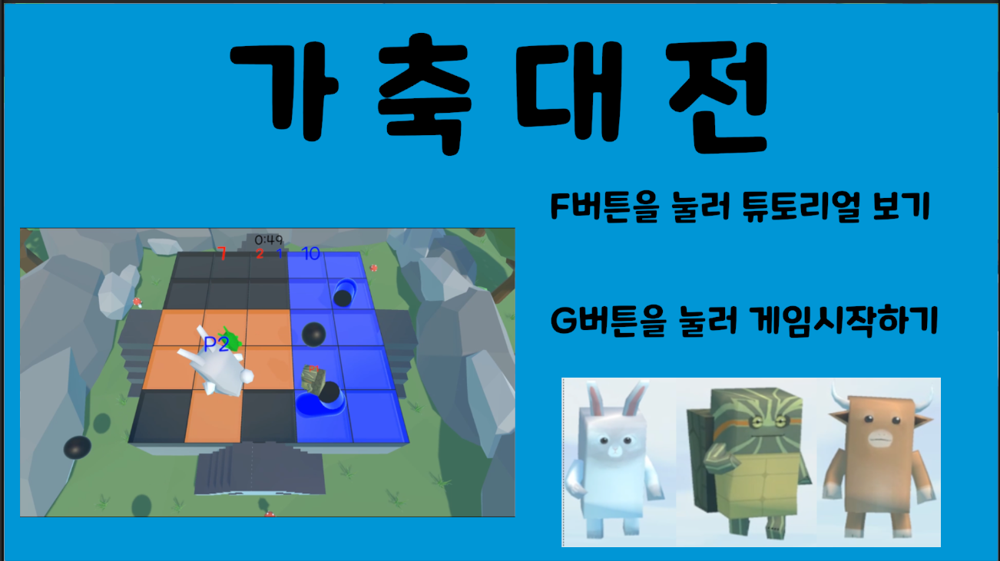
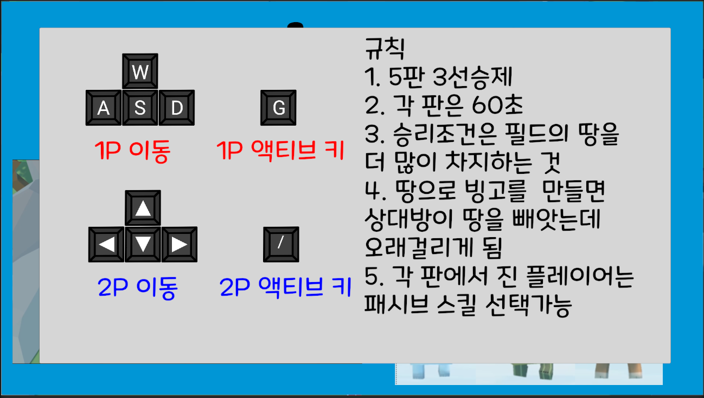
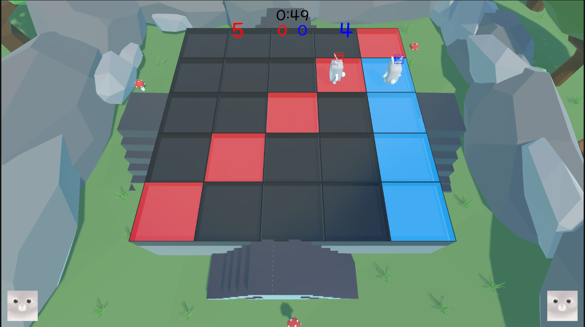
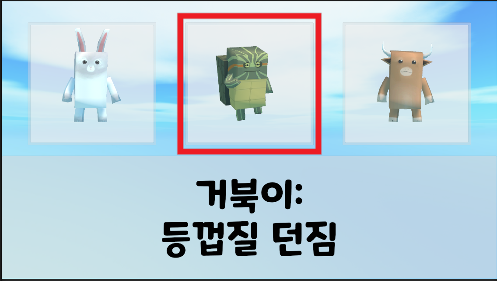
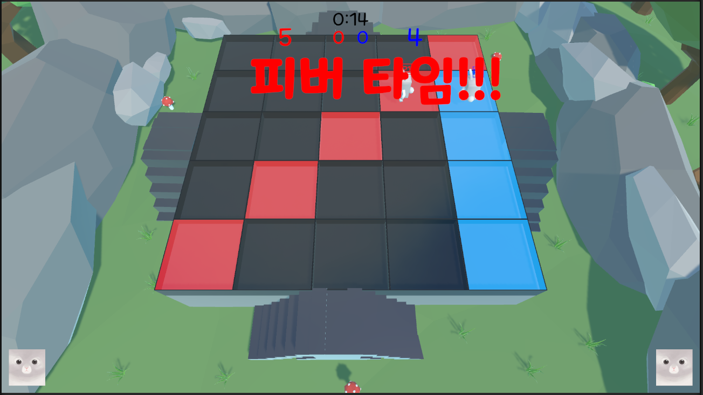
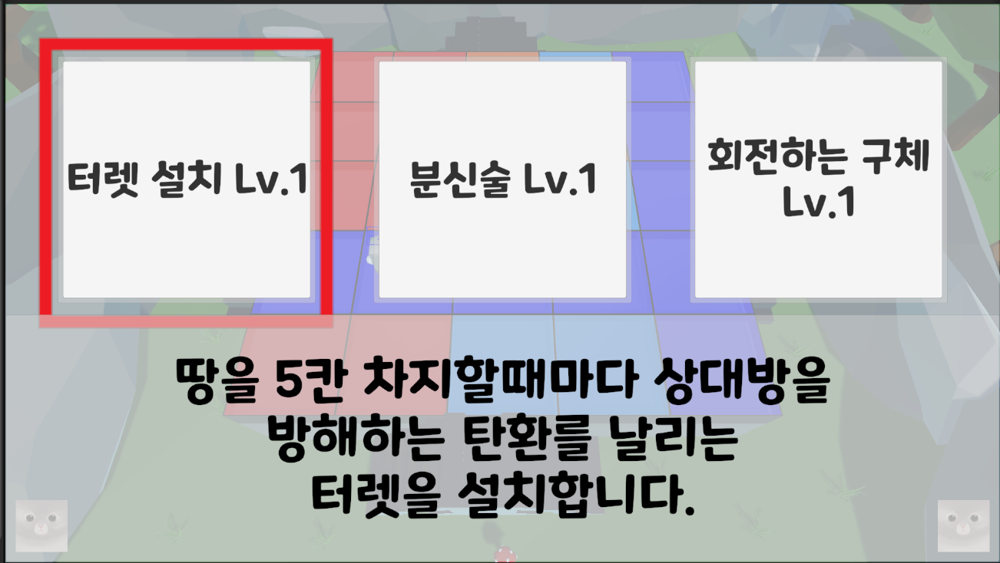

# AnimalAreaFight_UNITY




# Introduction
- 게임 제목: 가축대전
- 팀명: 백수의 왕
- 팀원:
    * [문석호(팀장)](https://github.com/khumsh)
    * [윤태웅](https://github.com/yuntaewoong)
    * [강수한](https://github.com/tngksdlstk12)
- 개발기간: 22'10'01 ~ 22'11'22
- 개발도구: Unity(2021.3.11f1) + C#
- 협업도구: Perforce + (AWS EC2서버)
- [Youtube](https://www.youtube.com/watch?v=SeQTM0eJTxo)


# Install
1. `git clone https://github.com/yuntaewoong/AnimalAreaFight_UNITY.git`명령어로 프로젝트 clone
2. Unity 2021.3.11f1버전으로 실행

# EXE
빌드파일 다운로드 링크: https://drive.google.com/file/d/18JjgZSft3OCPjEHNb-e_h1paD85e3T-_/view?usp=sharing

# Description
## 게임흐름

1.먼저 캐릭터를 선택(토끼,거북이,소 존재)  
각각의 캐릭터는 고유한 액티브 스킬을 사용할 수 있다.  
```
토끼: 거대화 + 속도증가
거북이: 상대방을 밀쳐내는 등껍질 발사
소: 주변 상대방을 밀쳐내는 충격파 발생
```


2.캐릭터 선택을 마치면 게임이 시작된다. 기본 룰은 다음과 같다.
```
- 발판을 특정시간동안 밟고 있으면 플레이어의 소유의 땅으로 변한다(빨강,파랑).
- 상대방 땅도 일정시간 밟고 있으면 플레이어 소유의 땅으로 변한다(대신 시간이 오래걸리게 된다).  
- 빙고를 완성하면 더 견고한 자신의 땅으로 변한다(더더욱 자신의 땅으로 만드는데 걸리는 시간이 오래걸리게 된다).
```

3. 15초가 남으면 피버타임이 시작된다.
```
피버타임중에는 발판을 매우 빠른속도로 자기 소유로 만들 수 있다.  
```

4.시간이 다 지나면 승부를 판정한다(더 색칠을 많이 한 플레이어의 승리).

5.진 플레이어에게는 게임의 판도를 바꿀 수 있는 `패시브 스킬`을 선택할 권한이 주어진다.   
6.게임 종료(5판 3선승)까지 3,4 과정을 반복한다.  

## 조작키
- `w`,`a`,`s`,`d` : 플레이어1 이동  
- `g` : 플레이어1 선택/액티브 스킬 키
- 화살표키: 플레이어2 이동
- `/` : 플레이어2 선택/액티브 스킬 키
